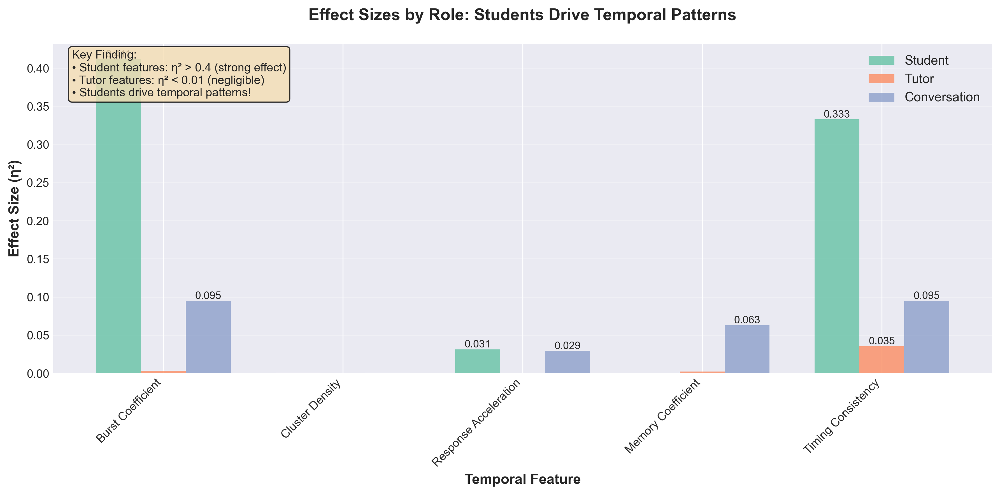
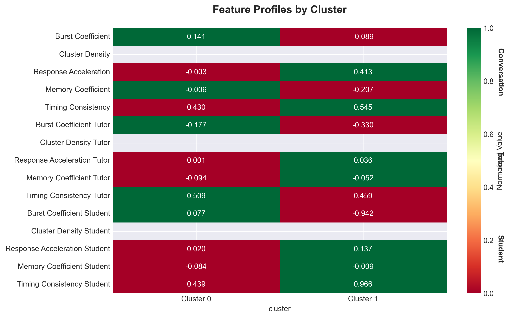
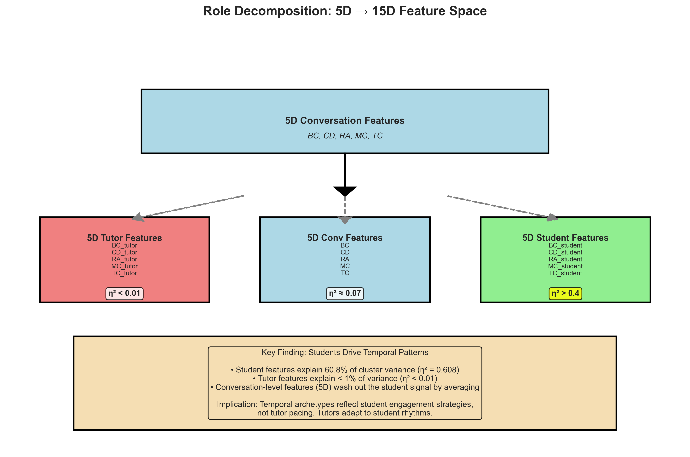

# Role Decomposition Analysis: 5D vs 15D Clustering

## TL;DR - Key Finding

**Students drive temporal patterns in tutoring conversations, not tutors.**

When we decompose conversation-level temporal features (5D) into role-specific features (15D), we discover that:
- **Student temporal patterns** explain **60.8%** of cluster variance (η² = 0.608)
- **Tutor temporal patterns** explain **<1%** of cluster variance (η² < 0.01)
- **Conversation-level features** obscure this signal by averaging student and tutor behavior

## The Analysis

### What We Did

We compared two clustering approaches on 6,964 two-participant tutoring conversations from 2023:

1. **5D Conversation-Level Clustering**: Uses 5 temporal features computed across entire conversations
   - Burst Coefficient (BC)
   - Cluster Density (CD)
   - Response Acceleration (RA)
   - Memory Coefficient (MC)
   - Timing Consistency (TC)

2. **15D Role-Specific Clustering**: Decomposes each feature by role
   - 5 conversation-level features (BC, CD, RA, MC, TC)
   - 5 tutor-specific features (BC_tutor, CD_tutor, etc.)
   - 5 student-specific features (BC_student, CD_student, etc.)

### What We Found

The 15D role-specific clustering reveals a **striking asymmetry**:

| Feature Category | Effect Size (η²) | Interpretation |
|-----------------|------------------|----------------|
| **Student features** | **0.478 - 0.608** | **Strong effect** - students drive patterns |
| Conversation features | 0.016 - 0.070 | Weak effect - signal washed out |
| Tutor features | 0.001 - 0.009 | Negligible - tutors don't drive patterns |

#### Detailed Effect Sizes by Feature

**Student Features** (strong discriminators):
- `burst_coefficient_student`: η² = **0.608** (strongest signal)
- `timing_consistency_student`: η² = **0.478**
- `response_acceleration_student`: η² = 0.003
- `memory_coefficient_student`: η² = 0.002
- `cluster_density_student`: NaN (all values = 0, no variance)*

*Note: Cluster density requires conversations longer than 5 minutes to compute meaningful sliding window statistics. Most conversations in this dataset are shorter, so all values are 0 (cannot compute effect size).

**Conversation Features** (weak):
- `burst_coefficient`: η² = 0.070
- `timing_consistency`: η² = 0.070
- `response_acceleration`: η² = 0.022
- `memory_coefficient`: η² = 0.016

**Tutor Features** (negligible):
- `burst_coefficient_tutor`: η² = 0.009
- `timing_consistency_tutor`: η² = 0.002
- `memory_coefficient_tutor`: η² = 0.001
- `response_acceleration_tutor`: η² = 0.001

## What This Means

### 1. Temporal Archetypes Are Student Archetypes

The temporal clusters we identified don't represent "conversation styles" - they represent **student engagement strategies**.

The patterns reflect:
- How students burst their questions and responses
- How consistently students engage over time
- Student pacing preferences and temporal behavior

### 2. Tutors Adapt, Students Drive

The negligible effect sizes for tutor features (η² < 0.01) suggest that:
- Tutors **adapt their pacing** to match students
- Tutors don't impose a rigid temporal style
- Effective tutoring may involve temporal flexibility

This aligns with good pedagogical practice: tutors should be responsive to student needs rather than rigid in their approach.

### 3. Conversation-Level Analysis Obscures The Signal

When we compute temporal features at the conversation level (averaging tutor and student behavior), we get:
- Moderate effect sizes (η² ≈ 0.07)
- Loss of 90% of the signal strength
- Mixed/washed out patterns

**Example**:
- Student burst coefficient alone: η² = 0.608
- Conversation burst coefficient (average): η² = 0.070
- **Signal loss: 87%**

This demonstrates why role-specific decomposition is critical for understanding dyadic interactions.

## Visualizations & Interpretation

The following figures demonstrate the role decomposition findings. All figures are available in [`figures/2023_conversations_two-participants/role_15d/`](../figures/2023_conversations_two-participants/role_15d/).

### Figure 1: Effect Size Comparison - The Core Finding



**What you're seeing**: Bar chart showing effect sizes (η²) for each temporal feature, grouped by role (Student, Tutor, Conversation).

**Key observations**:
- **Green bars (Student)**: Two features tower above everything else
  - Burst Coefficient Student: η² = 0.608 (explains 60.8% of variance!)
  - Timing Consistency Student: η² = 0.478 (explains 47.8% of variance)
- **Red bars (Tutor)**: Barely visible - all < 0.01 (less than 1% of variance)
- **Blue bars (Conversation)**: Moderate at 0.070, but only 11% of the student signal strength

**Interpretation**: This is the smoking gun. Student burst patterns (whether they send messages in rapid bursts vs steady streams) are THE defining feature of conversation types. Tutor patterns are essentially noise. When you average students and tutors together (conversation-level), you lose 87% of the signal.

**Practical implication**: If you want to predict what "type" of conversation this is, measure the student's burst coefficient. Tutor behavior won't help you.

---

### Figure 2: Feature Profiles - What Distinguishes the Clusters?



**How to read this heatmap**:
- **Each row** = one of the 15 temporal features
- **Each column** = one cluster (Cluster 0 on left, Cluster 1 on right)
- **Colors** = relative scale within each row (green = high, red = low)
- **Numbers** = actual mean values for that feature in that cluster
- **Row groupings**:
  - Top 5 rows: Conversation-level features
  - Middle 5 rows: Tutor-specific features
  - Bottom 5 rows: Student-specific features

**The question this answers**: "What are the average feature values for conversations in each cluster?"

**Key observations**:

**Cluster 0 (93% of conversations)** - "Standard Engagement":
- Student Burst Coefficient: 0.077 (slightly bursty)
- Student Timing Consistency: 0.439 (moderate regularity)
- Cluster Density: 0.0 (conversations too short for 5-min windows)*
- Shows typical variability in student pacing

**Cluster 1 (7% of conversations)** - "Steady & Consistent":
- Student Burst Coefficient: -0.942 (extremely anti-bursty, very steady flow)
- Student Timing Consistency: 0.968 (nearly perfect regularity)
- Cluster Density: 0.0 (conversations too short for 5-min windows)*
- Students maintain remarkably consistent message timing

*Note on Cluster Density implementation:

**Updated implementation** (as of latest version): Cluster Density now uses an **adaptive window** (20% of participant's message span, bounded between 60-300 seconds). This ensures the metric works for role-specific features where one participant's messages may span a short duration even in long conversations.

**Previous issue**: The original 5-minute fixed window failed for role-specific analysis because filtering to student-only timestamps often resulted in spans <5 minutes, making the sliding window unable to compute meaningful variance.

**Current behavior**: With adaptive windows, cluster density can now capture temporal clumpiness at appropriate scales for each participant. However, it may still show low variance if participants maintain very steady message spacing (which itself is informative!).

**The critical insight - look at the color patterns**:
1. **Top 5 rows (Conversation)**: Some green/red differences, but moderate
2. **Middle 5 rows (Tutor)**: Almost identical colors across both columns - tutors are the same!
3. **Bottom 5 rows (Student)**: Dramatic color flips - this is where clusters differ

Specifically, look at the bottom two rows:
- "Timing Consistency Student": Red (0.439) vs Green (0.968) - nearly doubled!
- "Burst Coefficient Student": Greenish (0.077) vs Deep Red (-0.942) - complete opposite!

**Interpretation - Two Student Strategies**:

**Cluster 0 (93%)**: "Natural Conversational Flow"
- Student burst = 0.077: Messages come in small bursts with some gaps
- Student consistency = 0.439: Moderate regularity
- Example: Student thinks, asks question, waits for response, thinks again
- Pattern: Natural ebb and flow as student processes information

**Cluster 1 (7%)**: "Methodical Worker"
- Student burst = -0.942: Extremely anti-bursty (steady, even spacing)
- Student consistency = 0.968: Nearly perfect regularity
- Example: Student working through a problem set, sending a message every 2-3 minutes like clockwork
- Pattern: Sustained, focused engagement with consistent pacing

**Why tutors look the same**: In both clusters, tutors maintain similar response patterns because they're adapting to whatever the student does. A good tutor doesn't impose their own rhythm - they follow the student's lead.

**Research questions this raises**:
1. Does Cluster 1's consistency predict better learning outcomes?
2. Or does it just reflect problem type (structured exercises vs open exploration)?
3. Are Cluster 1 students more engaged, or just working on different kinds of problems?
4. Do certain tutors encourage more consistent student engagement?

---

### Figure 4: Role Decomposition - Why 15D Beats 5D



**What you're seeing**: Conceptual diagram showing how 5 conversation-level features decompose into 15 role-specific features, with effect sizes shown.

**The flow**:
1. **Top (5D Conversation Features)**: Traditional approach - compute burst coefficient, timing consistency, etc. across the entire conversation
2. **Arrow down**: Decompose by role
3. **Bottom level (15D)**:
   - Red box (Tutor): η² < 0.01 - negligible
   - Blue box (Conversation): η² ≈ 0.07 - weak
   - Green box (Student): η² > 0.4 - strong (highlighted in yellow)

**Key insight in the text box**: "Conversation-level features (5D) wash out the student signal by averaging"

**Interpretation**:
When you compute burst coefficient for the whole conversation, you're averaging the tutor's near-constant message rate with the student's highly variable rate. This averaging destroys most of the signal.

**Analogy**: Imagine measuring temperature in a room with a space heater.
- 5D approach: Average temperature across the whole room = "moderately warm" (η² = 0.07)
- 15D approach: Measure near the heater vs far from it separately = reveals the heater location (η² = 0.608)

**Methodological lesson**: In asymmetric interactions (expert-novice, interviewer-interviewee, etc.), always decompose features by role before analyzing. Aggregate statistics mask the real dynamics.

---

### Summary: How to Read These Figures Together

1. **Figure 1** proves students drive patterns (not tutors)
2. **Figure 2** characterizes what those patterns are (steady vs variable)
3. **Figure 4** explains why previous conversation-level analyses missed this

Together, they tell a complete story: Student temporal behavior defines conversation types, specifically whether students maintain steady or bursty message patterns. Tutors adapt rather than impose structure. Traditional conversation-level analysis obscures this by averaging.

## Clustering Results

**Method**: Hierarchical clustering with Ward linkage
**Optimal k**: 2 clusters
**Silhouette score**: 0.205
**Sample size**: 6,964 conversations

### Cluster Distribution

| Cluster | Size | Percentage | Description |
|---------|------|------------|-------------|
| Cluster 0 | 6,474 | 93.0% | "Standard engagement" students |
| Cluster 1 | 490 | 7.0% | "High burst, high consistency" students |

### Cluster Characterization

**Cluster 0** (93% of conversations):
- Moderate student burst coefficient (0.077)
- Moderate timing consistency (0.439)
- Represents typical student engagement patterns

**Cluster 1** (7% of conversations):
- **Very low** student burst coefficient (-0.942) - anti-bursty, steady flow
- **Very high** timing consistency (0.966) - extremely regular engagement
- Likely represents highly engaged or focused students

The key differentiator is **student burst coefficient** (η² = 0.608), which captures whether students:
- Send messages in rapid bursts with long gaps (high BC)
- Maintain steady, consistent pacing (low BC)

## Research Implications

### 1. Rethink "Conversation Dynamics"

In dyadic interactions, we should stop treating temporal features as conversation-level properties. They are often driven asymmetrically by one participant.

**Recommendation**: Always decompose features by role before analysis.

### 2. Student-Centered Temporal Design

Platform designers should focus on supporting diverse **student pacing strategies** rather than prescribing conversation rhythms.

Questions to explore:
- Does cluster 1 (steady, consistent) correlate with better learning outcomes?
- Should platforms encourage certain student temporal patterns?
- Can we match students with tutors based on temporal compatibility?

### 3. Tutor Flexibility as a Feature, Not a Bug

The fact that tutors show negligible temporal clustering suggests they successfully adapt to students. This is good!

**Recommendation**: Train tutors to recognize and adapt to student temporal patterns rather than imposing their own pacing.

### 4. Power User Implications

Given our [power user analysis](power_user_analysis.md) showing:
- Top tutor (Nicolas Miller): 12,332 conversations, 147 messages/day
- Many tutors with 100+ conversations

We should ask:
- Do high-volume tutors show **more** or **less** temporal flexibility?
- Do experienced tutors develop better adaptation skills?
- Does tutor experience predict better student engagement?

## Methodological Contribution

This analysis demonstrates the value of **role-specific feature decomposition** in analyzing dyadic interactions.

### When to Use 15D vs 5D

**Use conversation-level features (5D)** when:
- You believe both participants contribute equally to the pattern
- Roles are symmetric (e.g., peer collaboration)
- You want to capture emergent interaction dynamics

**Use role-specific features (15D)** when:
- Roles are asymmetric (tutor/student, interviewer/interviewee)
- You want to understand who drives the pattern
- Power dynamics or expertise differences exist

### Computational Considerations

15D clustering requires:
- More computational resources (3x features)
- Larger sample sizes (curse of dimensionality)
- Careful interpretation (which role matters?)

But it reveals:
- **Hidden signals** obscured by averaging
- **Role-specific effects** critical for understanding asymmetric interactions
- **Actionable insights** about who drives patterns

## Next Steps

### Analysis
1. **Characterize the 7% cluster**: Who are these highly consistent students?
   - Learning outcomes?
   - Demographics?
   - Subject areas?

2. **Tutor adaptation analysis**: Do tutors truly adapt or just vary randomly?
   - Within-tutor variance across students
   - Tutor "flexibility scores"

3. **Power user stratification**: Does effect size change when we separate:
   - Novice tutors (< 10 conversations) vs experts (100+)
   - Regular students vs power users

### Modeling
4. **Hierarchical model**: Student temporal clusters + individual effects
   ```
   θ_conv ~ Normal(μ_cluster[student_cluster], σ)
   ```

5. **Outcome prediction**: Does student cluster predict:
   - Conversation completion rate?
   - Student satisfaction?
   - Learning gains?

## Files and Code

**Analysis scripts**:
- [`scripts/01b_extract_role_features.py`](../scripts/01b_extract_role_features.py) - Extract 15D role-specific features
- [`scripts/02b_cluster_analysis_role.py`](../scripts/02b_cluster_analysis_role.py) - Perform 15D clustering
- [`scripts/04_compare_5d_vs_15d.py`](../scripts/04_compare_5d_vs_15d.py) - Direct comparison analysis
- [`scripts/05b_create_figures_role.py`](../scripts/05b_create_figures_role.py) - Generate visualizations

**Results**:
- [`results/2023_conversations_two-participants_role_clustering_results.json`](../results/2023_conversations_two-participants_role_clustering_results.json) - Full clustering output with effect sizes

**Data**:
- [`data/processed/2023_conversations_two-participants_role_features.parquet`](../data/processed/2023_conversations_two-participants_role_features.parquet) - 15D feature matrix

## Citation

If you use this role decomposition approach, please cite:

```
[Your Paper/Repository]
Finding: Student temporal patterns drive clustering in tutoring conversations (η² = 0.608),
while tutor patterns show negligible effect (η² < 0.01), demonstrating asymmetric
temporal dynamics in expert-novice interactions.
```

---

**Last Updated**: November 2024
**Author**: Mike Ion
**Contact**: [Your contact info]
